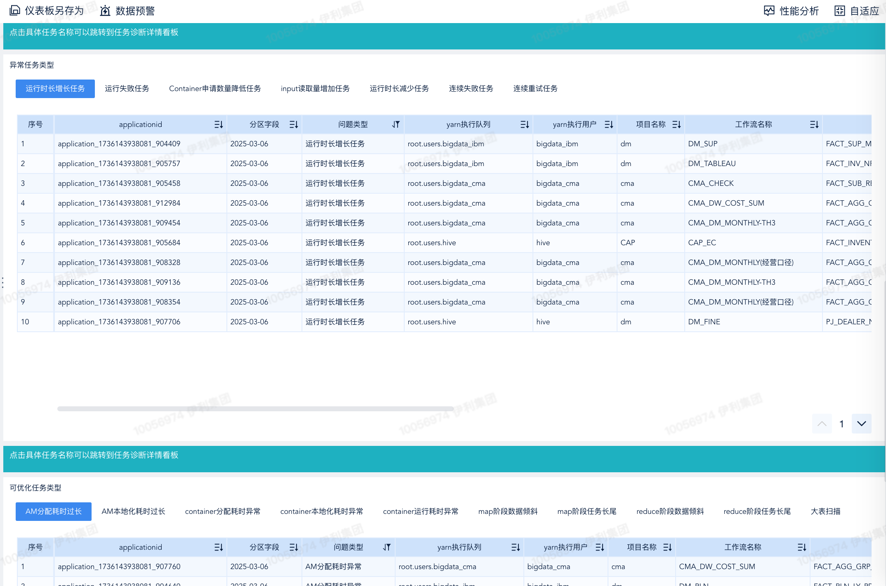

# 大数据诊断平台
这是一个诊断大数据生态系统中计算引擎和调度器的平台，旨在提高故障排除的效率并降低问题根因排查的难度
通过脚本定时或者实时收集日志和指标

其主要功能特性如下：

- 非侵入式，即时诊断，无需修改已有的调度平台，即可体验诊断效果。
- 支持HDFS文件元数据解析和诊断
- 支持StarRocks引擎诊断分析
- 支持多种主流调度平台，例如DolphinScheduler 1.x、2.x和3.x。
- 支持多版本Spark、MapReduce、Hadoop 2.x和3.x 任务日志诊断和解析。
- 支持工作流层异常诊断，识别各种失败和基线耗时异常问题。
- 支持引擎层异常诊断，包含数据倾斜、大表扫描、内存浪费等14种异常类型。

## 支持组件
- [x] HDFS
- [x] StarRocks
- [x] Spark
- [x] Mapreduce
- [x] DolphinScheduler

## 架构图

## 支持诊断类型

<table>
    <tr>
        <td>引擎</td>
        <td>诊断维度</td>
        <td>诊断类型</td>
        <td>类型说明</td>
    </tr>
    <tr>
        <td rowspan="6">Dolphinscheduler</td>
        <td rowspan="3">失败分析</td>
        <td>运行失败</td>
        <td>最终运行失败的任务</td>
    </tr>
    <tr>
        <td>首次失败</td>
        <td>重试次数大于1的成功任务</td>
    </tr>
    <tr>
        <td>长期失败</td>
        <td>最近10天运行失败的任务</td>
    </tr>
    <tr>
        <td rowspan="3">耗时分析</td>
        <td>基线时间异常</td>
        <td>相对于历史正常结束时间，提前结束或晚点结束的任务</td>
    </tr>
    <tr>
        <td>基线耗时异常</td>
        <td>相对于历史正常运行时长，运行时间过长或过短的任务</td>
    </tr>
    <tr>
        <td>运行耗时长</td>
        <td>运行时间超过2小时的任务</td>
    </tr>
    <tr>
        <td rowspan="14">Spark</td>
        <td rowspan="3">报错分析</td>
        <td>sql失败</td>
        <td>因sql执行问题而导致失败的任务</td>
    </tr>
    <tr>
        <td>shuffle失败</td>
        <td>因shuffle执行问题而导致失败的任务</td>
    </tr>
    <tr>
        <td>内存溢出</td>
        <td>因内存溢出问题而导致失败的任务</td>
    </tr>
    <tr>
        <td rowspan="2">资源分析</td>
        <td>内存浪费</td>
        <td>内存使用峰值与总内存占比过低的任务</td>
    </tr>
    <tr>
        <td>CPU浪费</td>
        <td>driver/executor计算时间与总CPU计算时间占比过低的任务</td>
    </tr>
    <tr>
        <td rowspan="9">效率分析</td>
        <td>大表扫描</td>
        <td>没有限制分区导致扫描行数过多的任务</td>
    </tr>
    <tr>
        <td>OOM预警</td>
        <td>广播表的累计内存与driver或executor任意一个内存占比过高的任务</td>
    </tr>
    <tr>
        <td>数据倾斜</td>
        <td>stage中存在task处理的最大数据量远大于中位数的任务</td>
    </tr>
    <tr>
        <td>Job耗时异常</td>
        <td>job空闲时间与job运行时间占比过高的任务</td>
    </tr>
    <tr>
        <td>Stage耗时异常</td>
        <td>stage空闲时间与stage运行时间占比过高的任务</td>
    </tr>
    <tr>
        <td>Task长尾</td>
        <td>stage中存在task最大运行耗时远大于中位数的任务</td>
    </tr>
    <tr>
        <td>HDFS卡顿</td>
        <td>stage中存在task处理速率过慢的任务</td>
    </tr>
    <tr>
        <td>推测执行Task过多</td>
        <td>stage中频繁出现task推测执行的任务</td>
    </tr>
    <tr>
        <td>全局排序异常</td>
        <td>全局排序导致运行耗时过长的任务</td>
    </tr>
    <tr>
        <td rowspan="6">MapReduce</td>
        <td rowspan="1">资源分析</td>
        <td>内存浪费</td>
        <td>内存使用峰值与总内存占比过低的任务</td>
    </tr>
    <tr>
        <td rowspan="5">效率分析</td>
        <td>大表扫描</td>
        <td>扫描行数过多的任务</td>
    </tr>
    <tr>
        <td>Task长尾</td>
        <td>map/reduce task最大运行耗时远大于中位数的任务</td>
    </tr>
    <tr>
        <td>数据倾斜</td>
        <td>map/reduce task处理的最大数据量远大于中位数的任务</td>
    </tr>
    <tr>
        <td>推测执行Task过多</td>
        <td>map/reduce task中频繁出现推测执行的任务</td>
    </tr>
    <tr>
        <td>GC异常</td>
        <td>GC时间相对CPU时间占比过高的任务</td>
    </tr>
    <tr>
        <td rowspan="3">HDFS</td>
        <td rowspan="3">资源分析</td>
        <td>小文件占比</td>
        <td>小文件较多的目录或者表</td>
    </tr>
    <tr>
        <td>文件冷热占比</td>
        <td>冷数据存储较多的目录或者表</td>
    </tr>
    <tr>
        <td>历史文件被修改和访问</td>
        <td>超过5年的历史文件被修改和访问</td>
    </tr>
    <tr>
        <td rowspan="6">StarRocks</td>
        <td rowspan="5">资源分析</td>
        <td>分桶不合理</td>
        <td>tablet size太小或者太大</td>
    </tr>
    <tr>
        <td>分区不合理</td>
        <td>空分区、过大或者过小的分区</td>
    </tr>
    <tr>
        <td>扫描数据量过多</td>
        <td>根据执行计划判断扫描数据量过多的查询</td>
    </tr>
    <tr>
        <td>查询频次分析</td>
        <td>对表按照查询次数排序</td>
    </tr>
    <tr>
        <td>导入分析</td>
        <td>对导入频次和数据量分析</td>
    </tr>
</table>

## 看板

全链路诊断:

报错任务诊断:

